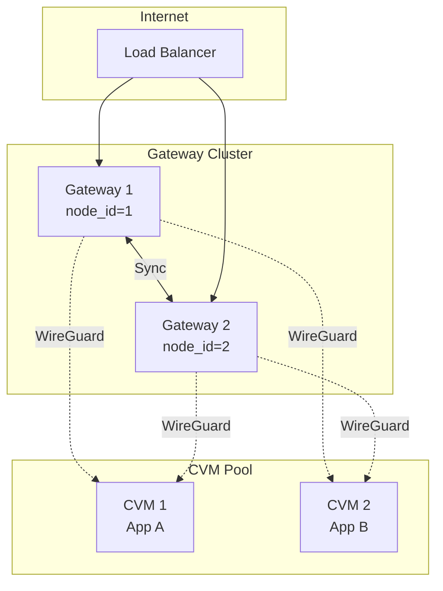

# dstack-gateway Cluster Deployment Guide

This document describes how to deploy a dstack-gateway cluster, including single-node and multi-node configurations.

## Table of Contents

1. [Overview](#1-overview)
2. [Cluster Deployment (2-Node Example)](#2-cluster-deployment-2-node-example)
3. [CVM Deployment via dstack-vmm](#3-cvm-deployment-via-dstack-vmm)
4. [App Ingress and Port Routing](#4-app-ingress-and-port-routing)
5. [Deploying a Test App](#5-deploying-a-test-app)
6. [Adding Reverse Proxy Domains](#6-adding-reverse-proxy-domains)

## 1. Overview

dstack-gateway is a distributed reverse proxy gateway for dstack services. Key features include:

- TLS termination and SNI routing: Automatically selects certificates and routes traffic based on SNI
- Automatic certificate management: Automatically requests and renews certificates via ACME protocol (Let's Encrypt)
- Multi-node cluster: Multiple gateway nodes automatically sync state for high availability
- WireGuard tunnels: Provides secure network access for CVM instances

### Architecture Diagram



When a CVM starts, it registers with one of the Gateways. The Gateway cluster automatically syncs the CVM's information (including WireGuard public key), enabling all Gateway nodes to establish WireGuard tunnel connections to that CVM.

### Port Description

| Default Port | Protocol | Purpose | Security Recommendation |
|--------------|----------|---------|-------------------------|
| 9012 | HTTPS | RPC port for inter-node sync communication | Internal network only |
| 9013 | UDP | WireGuard tunnel port | Internal network only |
| 9014 | HTTPS | Proxy port for external TLS proxy service | Can be exposed to public |
| 9015 | HTTP | Debug port for health checks and debugging | Must be disabled in production |
| 9016 | HTTP | Admin port for management API | Do not expose to public, recommend using Unix Domain Socket |

Production security configuration example:

```toml
[core.debug]
insecure_enable_debug_rpc = false  # Disable Debug port

[core.admin]
enabled = true
address = "unix:/run/dstack/admin.sock"  # Use Unix Domain Socket
```

### Resource Sizing

Recommended minimum per gateway node:

| Workload | vCPU | Memory | Disk |
|----------|------|--------|------|
| Small (< 100 CVMs) | 4 | 4 GB | 20 GB |
| Medium (100-1000 CVMs) | 8 | 8 GB | 20 GB |
| Large (> 1000 CVMs) | 16+ | 16+ GB | 20 GB |

### Networking Modes

dstack CVM supports two networking modes:

| Mode | Description | Port Mapping | Use Case |
|------|-------------|--------------|----------|
| `user` (default) | QEMU user-mode networking with explicit host port forwarding | Required — each service port must be mapped to a host port | Standard deployments; simple setup |
| `bridge` | CVM gets its own IP on the host bridge network | Not needed — CVM is directly addressable by its bridge IP | High-performance scenarios requiring full network throughput |

In **user mode**, the CVM accesses the external network via QEMU's built-in NAT. Each service port (RPC, WireGuard, proxy, admin) is individually forwarded from a host port to the corresponding guest port. This is the default and works with any VMM configuration.

In **bridge mode**, the CVM is attached to the host's bridge interface (e.g., `dstack-br0`) and receives its own IP address via DHCP or static assignment. All ports are directly accessible on that IP without port mapping. This avoids the overhead of QEMU user-mode NAT and is recommended for production deployments that need maximum network performance.

To use bridge mode, set `NET_MODE=bridge` in the `.env` file. The VMM must have a bridge interface configured in `vmm.toml`:

```toml
[cvm.networking]
mode = "bridge"    # or keep "user" as default; bridge is selected per-VM via deploy script
bridge = "dstack-br0"
```

## 2. Cluster Deployment (2-Node Example)

### 2.1 Node Planning

| Node | node_id | Gateway IP | Client IP range | bootnode |
|------|---------|------------|-----------------|----------|
| gateway-1 | 1 | 10.8.0.1/16 | 10.8.0.0/18 | none |
| gateway-2 | 2 | 10.8.64.1/16 | 10.8.64.0/18 | gateway-1 |

Notes:
- Each node's `node_id` must be unique and greater than 0
- Each node's Client IP range must not overlap (used for allocating IPs to different CVMs)
- `bootnode` is optional — it speeds up initial peer discovery but is not required. Without a bootnode, a node will auto-discover peers when they connect via sync RPC
- If a bootnode is set, its hostname must be resolvable before cluster bootstrap

### 2.2 CIDR Description

Client IP range (/18):
- /18 means the first 18 bits are the network prefix
- For example, 10.8.0.0/18 covers the address range 10.8.0.0 ~ 10.8.63.255
- Each Gateway's /18 range does not overlap, so each Gateway can allocate IPs locally without syncing with other Gateways
- With 4 possible /18 ranges in a /16 network, a cluster supports up to 4 gateway nodes

Gateway IP (/16):
- Gateway IP uses /16 netmask to allow network routing to cover the larger 10.8.0.0/16 address space
- This way, when another Gateway allocates an address in a /18 subnet, traffic can still be correctly routed

Subnet mapping:

| SUBNET_INDEX | Gateway IP | Client IP range | Address range | Usable IPs |
|-------------|------------|-----------------|---------------|------------|
| 0 | 10.8.0.1/16 | 10.8.0.0/18 | 10.8.0.0 ~ 10.8.63.255 | 16,382 |
| 1 | 10.8.64.1/16 | 10.8.64.0/18 | 10.8.64.0 ~ 10.8.127.255 | 16,382 |
| 2 | 10.8.128.1/16 | 10.8.128.0/18 | 10.8.128.0 ~ 10.8.191.255 | 16,382 |
| 3 | 10.8.192.1/16 | 10.8.192.0/18 | 10.8.192.0 ~ 10.8.255.255 | 16,382 |

### 2.3 WireGuard Configuration Fields

Key fields in the `[core.wg]` section:

- `ip`: Gateway's own WireGuard address in CIDR format (e.g., 10.8.0.1/16)
- `client_ip_range`: Address pool range for allocating to CVMs (e.g., 10.8.0.0/18)
- `reserved_net`: Reserved address range that will not be allocated to CVMs (e.g., 10.8.0.1/32, reserving the gateway's own address)

Recommendation: Design client_ip_range and reserved_net to ensure clear address pool planning for each Gateway, avoiding address conflicts.

### 2.4 Cluster Sync and Peer Discovery

> **Image version note**: The sync enable logic varies by gateway image version. In `dstacktee/dstack-gateway:0.5.8`, sync is enabled when `NODE_ID > 0` (regardless of `BOOTNODE_URL`). In some custom-built images, sync may only be enabled when `BOOTNODE_URL` is non-empty. Check your image's `entrypoint.sh` to confirm the behavior. When in doubt, set `NODE_ID > 0` and provide a `BOOTNODE_URL` on at least one node.

Gateway nodes discover each other through two mechanisms:

1. **Bootnode discovery** (active): A node with `bootnode` configured will fetch the peer list from the bootnode at startup, then periodically retry until peers are found.

2. **Auto-discovery** (passive): When a remote node sends a sync request, the local node automatically adds it as a peer. This means the first node in a cluster does not need a bootnode — it will be discovered when the second node connects to it.

This allows a simple deployment order:
1. Start gateway-1 with `bootnode = ""` (no bootnode)
2. Start gateway-2 with `bootnode = "https://rpc.gateway-1:9012"`
3. Gateway-2 fetches peers from gateway-1 and starts syncing
4. Gateway-1 auto-discovers gateway-2 from the incoming sync request

> Note: `bootnode` is only used for initial discovery. Once peers are discovered, they are persisted in the KV store and survive restarts.

### 2.5 Configuration File Examples

gateway-1.toml:

```toml
log_level = "info"
address = "0.0.0.0"
port = 9012

[tls]
key = "/var/lib/gateway/certs/gateway-rpc.key"
certs = "/var/lib/gateway/certs/gateway-rpc.cert"

[tls.mutual]
ca_certs = "/var/lib/gateway/certs/gateway-ca.cert"
mandatory = false

[core]
kms_url = "https://kms.demo.dstack.org"
rpc_domain = "rpc.gateway-1.demo.dstack.org"

[core.admin]
enabled = true
port = 9016
address = "0.0.0.0"

[core.debug]
insecure_enable_debug_rpc = true
insecure_skip_attestation = false
port = 9015
address = "0.0.0.0"

[core.sync]
enabled = true
interval = "30s"
timeout = "60s"
my_url = "https://rpc.gateway-1.demo.dstack.org:9012"
bootnode = ""
node_id = 1
data_dir = "/var/lib/gateway/data"

[core.wg]
private_key = "<node1-private-key>"
public_key = "<node1-public-key>"
listen_port = 9013
ip = "10.8.0.1/16"
reserved_net = ["10.8.0.1/32"]
client_ip_range = "10.8.0.0/18"
config_path = "/var/lib/gateway/wg.conf"
interface = "wg-gw1"
endpoint = "<host ip>:9013"

[core.proxy]
listen_addr = "0.0.0.0"
listen_port = 9014
external_port = 443
```

gateway-2.toml:

```toml
log_level = "info"
address = "0.0.0.0"
port = 9012

[tls]
key = "/var/lib/gateway/certs/gateway-rpc.key"
certs = "/var/lib/gateway/certs/gateway-rpc.cert"

[tls.mutual]
ca_certs = "/var/lib/gateway/certs/gateway-ca.cert"
mandatory = false

[core]
kms_url = "https://kms.demo.dstack.org"
rpc_domain = "rpc.gateway-2.demo.dstack.org"

[core.sync]
enabled = true
interval = "30s"
timeout = "60s"
my_url = "https://rpc.gateway-2.demo.dstack.org:9012"
bootnode = "https://rpc.gateway-1.demo.dstack.org:9012"
node_id = 2
data_dir = "/var/lib/gateway/data"

[core.wg]
private_key = "<node2-private-key>"
public_key = "<node2-public-key>"
listen_port = 9013
ip = "10.8.64.1/16"
reserved_net = ["10.8.64.1/32"]
client_ip_range = "10.8.64.0/18"
config_path = "/var/lib/gateway/wg.conf"
interface = "wg-gw2"
endpoint = "<host ip>:9013"

[core.proxy]
listen_addr = "0.0.0.0"
listen_port = 9014
external_port = 443
```

### 2.6 Single-Host Deployment Notes

If you run multiple gateway nodes on the same physical host (for example, multiple CVMs on one teepod / dstack-vmm host), the default example ports above will conflict. You must assign distinct host-facing ports per node.

Example host port plan for two nodes on one host:

| Node | RPC (host) | Admin (host) | WireGuard (host) | Proxy (host) | Guest Agent (host) |
|------|------------|--------------|------------------|--------------|--------------------|
| gateway-1 | 19602 | 19603 | 19613/udp | 19643 | 19606 |
| gateway-2 | 19702 | 19703 | 19713/udp | 19743 | 19706 |

Important:

- All these host ports must be within the VMM's `port_mapping.range` configuration
- If both nodes should serve the same public wildcard domain on `:443`, place a TCP load balancer / `nginx stream` / HAProxy in front of them and fan out to the two proxy backend ports
- Each gateway VM must have a **unique name** when deployed to the same VMM (e.g., `dstack-gateway-1` and `dstack-gateway-2`)
- Create DNS records for the RPC hostnames before bootstrapping the cluster

### 2.7 Verify Cluster Sync

```bash
# Check sync status on any node (replace port with your admin port)
curl -s http://localhost:9016/prpc/WaveKvStatus | jq .

# List known cluster nodes
curl -s http://localhost:9016/prpc/Status | jq '.nodes'
```

A healthy cluster sync shows:
- `enabled: true` on all nodes
- Each node appears in every other node's `.nodes` array
- `last_seen` timestamps are recent (within the sync interval)
- `peer_ack` values are close to `local_ack` (no large lag)

Example of a healthy 2-node status:

```json
{
  "id": 1,
  "url": "https://rpc.gateway-1:9012",
  "num_connections": 5,
  "nodes": [
    {"id": 1, "url": "https://rpc.gateway-1:9012", "last_seen": 1773884104},
    {"id": 2, "url": "https://rpc.gateway-2:9012", "last_seen": 1773884100}
  ]
}
```

## 3. CVM Deployment via dstack-vmm

When deploying gateways as CVMs via `gateway/dstack-app/`, the deployment is automated through `deploy-to-vmm.sh`. This section explains the CVM-specific workflow.

### 3.1 Prerequisites

- A running dstack-vmm instance with available resources
- A dstack OS image (e.g., `dstack-0.5.8`)
- DNS records for the service domain and RPC hostnames (see section 3.2)
- A Cloudflare API token with DNS edit permissions for the zone (for ACME DNS-01 challenges)

### 3.2 DNS Records

Before deploying, create the following DNS records pointing to the host's public IP:

| Record | Type | Value | Purpose |
|--------|------|-------|---------|
| `*.example.com` | A | `<host-ip>` | Wildcard for proxy traffic |
| `gateway-1.example.com` | A | `<host-ip>` | RPC hostname for node 1 |
| `gateway-2.example.com` | A | `<host-ip>` | RPC hostname for node 2 |

> **Note**: If your wildcard record (`*.example.com`) already covers subdomains like `gateway-1.example.com`, you only need explicit A records for hostnames that must resolve before the wildcard is created, or when using a different IP per node. In most single-host deployments, the wildcard alone is sufficient for all subdomains.

### 3.2.1 Known Issues with `.env` Template

The auto-generated `.env` template (created on first run of `deploy-to-vmm.sh`) is missing the `KMS_URL` variable, which is required. You must add it manually:

```bash
KMS_URL=https://your-kms-endpoint:port
```

### 3.3 GATEWAY_APP_ID

Each gateway cluster shares a single `GATEWAY_APP_ID`. This ID determines the cryptographic identity of the gateway and must be the same across all nodes in the cluster.

- **On-chain KMS**: Set `GATEWAY_APP_ID` to the registered app contract address (e.g., `4d6e361b90b3510da8611fe771b1bfddc8ffa4b8`). You must also whitelist the compose hash on-chain (printed by `deploy-to-vmm.sh` as `Compose hash: 0x...`) before the CVM can boot successfully.
- **Test KMS** (dev mode): Define any hex string as the app ID (e.g., `deadbeef0123456789abcdef0123456789abcdef`). All nodes must use the same value. No compose hash whitelisting is needed in dev mode.

### 3.4 Environment Variables

The `.env` file configures the deployment. Key variables:

| Variable | Required | Description |
|----------|----------|-------------|
| `VMM_RPC` | Yes | VMM RPC endpoint (e.g., `http://127.0.0.1:12000` or `unix:../build/vmm.sock`) |
| `SRV_DOMAIN` | Yes | Service domain (e.g., `example.com`). Used for ZT-Domain and default RPC_DOMAIN |
| `PUBLIC_IP` | Yes | Host's public IPv4 address |
| `NODE_ID` | Yes | Unique node ID (1, 2, ...). Must be > 0 for sync to be enabled |
| `GATEWAY_APP_ID` | Yes | App ID (see section 3.3) |
| `KMS_URL` | Yes | KMS endpoint URL |
| `MY_URL` | Yes | This node's RPC URL (e.g., `https://gateway-1.example.com:19602`) |
| `CF_API_TOKEN` | Yes | Cloudflare API token for DNS-01 ACME challenges |
| `BOOTNODE_URL` | No | Another node's RPC URL for initial peer discovery |
| `SUBNET_INDEX` | No | Subnet index (0-3), determines WG IP allocation. Default: 0 |
| `NET_MODE` | No | `bridge` or `user` (default: `user`). In `user` mode, ports are explicitly forwarded from host to guest. In `bridge` mode, the CVM gets its own IP on the host bridge and all ports are directly accessible — no host port mapping needed, but the VMM must have a bridge interface configured (see [Networking Modes](#networking-modes)) |
| `OS_IMAGE` | No | dstack OS image name. Default: `dstack-0.5.5` |
| `ACME_STAGING` | No | `yes` to use Let's Encrypt staging. Default: `no` |
| `GATEWAY_IMAGE` | No | Docker image for the gateway container |
| `RPC_DOMAIN` | No | RPC hostname for this node. Default: `gateway.<SRV_DOMAIN>` |

> **Note on `RPC_DOMAIN`**: By default, `RPC_DOMAIN` is derived as `gateway.<SRV_DOMAIN>`. In a multi-node cluster where each node has its own RPC hostname (e.g., `gateway-1.example.com`, `gateway-2.example.com`), the `MY_URL` already identifies each node uniquely. The `RPC_DOMAIN` controls the hostname used for the RA-TLS certificate on the RPC endpoint.

Port variables (required when `NET_MODE=user`):

| Variable | Default | Description |
|----------|---------|-------------|
| `GATEWAY_RPC_ADDR` | `0.0.0.0:9202` | Host address for RPC port |
| `GATEWAY_ADMIN_RPC_ADDR` | `127.0.0.1:9203` | Host address for admin port |
| `GATEWAY_SERVING_PORT` | `9204` | Host port for proxy traffic |
| `GUEST_AGENT_ADDR` | `127.0.0.1:9206` | Host address for guest agent |
| `WG_ADDR` | `0.0.0.0:9202` | Host address for WireGuard UDP. Defaults to the same port as `GATEWAY_RPC_ADDR` |

> **Note**: By default, `GATEWAY_RPC_ADDR` and `WG_ADDR` share the same host port (9202) — this works because RPC uses TCP and WireGuard uses UDP. When deploying multiple nodes on the same host, each node must use a different port number for both. If you only set `GATEWAY_RPC_ADDR`, remember to also set `WG_ADDR` to match (or to a different port if desired).

### 3.5 Deployment Steps

```bash
cd gateway/dstack-app

# 1. First run creates a template .env — edit it with your values
bash deploy-to-vmm.sh

# 2. Edit .env (set VMM_RPC, SRV_DOMAIN, PUBLIC_IP, NODE_ID, GATEWAY_APP_ID, KMS_URL, MY_URL, CF_API_TOKEN, etc.)

# 3. Deploy node 1 (no BOOTNODE_URL needed)
bash deploy-to-vmm.sh

# 4. Bootstrap admin config (only once per cluster)
bash bootstrap-cluster.sh

# 5. For node 2, create a separate directory with its own .env:
cp -r . ../deploy-node2 && cd ../deploy-node2
#    Edit .env with:
#    - NODE_ID=2
#    - SUBNET_INDEX=1
#    - MY_URL=https://gateway-2.example.com:<node2-rpc-port>
#    - Different port assignments if on same host (see section 2.6)
#    - BOOTNODE_URL=<node-1-rpc-url> (optional, speeds up discovery)
#    Edit deploy-to-vmm.sh: change --name to dstack-gateway-2
bash deploy-to-vmm.sh
# No need to run bootstrap-cluster.sh — config syncs from node 1
```

The deploy script (`deploy-to-vmm.sh`) automatically:
- Computes WG IP allocation from SUBNET_INDEX
- Creates the app-compose.json and encrypts environment variables via KMS
- Deploys the CVM to the VMM

The bootstrap script (`bootstrap-cluster.sh`) configures:
- ACME certbot settings
- DNS credentials (Cloudflare)
- ZT-Domain registration

**Important**: Admin bootstrap (ACME config, DNS credentials, ZT-Domain setup) is a separate step via `bootstrap-cluster.sh` and only needs to run once per cluster. Additional nodes receive these configurations automatically via cluster sync.

```bash
# After deploying the first node:
bash bootstrap-cluster.sh                       # reads GATEWAY_ADMIN_RPC_ADDR from .env
bash bootstrap-cluster.sh 192.168.1.10:8001     # or specify admin address directly
```

**VM naming**: The deploy script hardcodes `--name dstack-gateway`. When deploying multiple nodes to the same VMM, you **must** edit the script to use unique names (e.g., `dstack-gateway-1`, `dstack-gateway-2`), otherwise deployment will fail with a name conflict. A recommended approach is to copy the entire `dstack-app/` directory per node:

```bash
# Create per-node deployment directories
cp -r gateway/dstack-app gateway/deploy-node1
cp -r gateway/dstack-app gateway/deploy-node2

# In each directory's deploy-to-vmm.sh, change the --name argument:
#   deploy-node1: --name dstack-gateway-1
#   deploy-node2: --name dstack-gateway-2
# Edit each directory's .env with node-specific values
```

> **Tip**: Consider parameterizing the VM name via an environment variable (e.g., `VM_NAME` in `.env`) instead of editing the script directly, to avoid accidentally losing the change when updating `deploy-to-vmm.sh`.

### 3.6 Updating Environment Variables

To update a running gateway's environment (e.g., adding BOOTNODE_URL):

```bash
# Create updated env file
cat > updated.env <<EOF
WG_ENDPOINT=<ip>:<port>
MY_URL=https://gateway-1.example.com:19602
BOOTNODE_URL=https://gateway-2.example.com:19702
# ... other vars ...
EOF

# Update and restart
vmm-cli.py --url <vmm-url> update-env --env-file updated.env <vm-id>
vmm-cli.py --url <vmm-url> stop <vm-id>
vmm-cli.py --url <vmm-url> start <vm-id>
```

## 4. App Ingress and Port Routing

When a CVM registers with the gateway, its services become accessible via subdomains of the gateway's ZT-Domain. The gateway determines the backend port from the **SNI hostname** of the incoming request, not from the docker-compose port mapping.

### SNI Format

```
<instance_id>[-[<port>][s|g]].<base_domain>
```

| SNI Pattern | Backend Port | Mode |
|-------------|-------------|------|
| `<id>.example.com` | **80** (default) | TLS termination → TCP |
| `<id>-8080.example.com` | 8080 | TLS termination → TCP |
| `<id>-443s.example.com` | 443 | TLS passthrough (no termination) |
| `<id>-50051g.example.com` | 50051 | TLS termination → HTTP/2 (gRPC) |

**Common pitfall**: If your docker-compose uses `443:80` (host 443, container 80), the container listens on CVM port 443, but the default SNI (no port suffix) routes to port **80**. Either:
- Use `80:80` in your compose so the default port matches, or
- Access via `<id>-443.example.com` to explicitly target port 443

### Example

```bash
INSTANCE_ID="abc123..."
BASE_DOMAIN="example.com"
GW_PROXY_PORT=19643

# Default (port 80)
curl -sk --resolve "${INSTANCE_ID}.${BASE_DOMAIN}:${GW_PROXY_PORT}:127.0.0.1" \
  "https://${INSTANCE_ID}.${BASE_DOMAIN}:${GW_PROXY_PORT}/"

# Explicit port 8080
curl -sk --resolve "${INSTANCE_ID}-8080.${BASE_DOMAIN}:${GW_PROXY_PORT}:127.0.0.1" \
  "https://${INSTANCE_ID}-8080.${BASE_DOMAIN}:${GW_PROXY_PORT}/"
```

## 5. Deploying a Test App

After deploying the gateway cluster, verify end-to-end connectivity by deploying a simple app CVM that registers with the gateway.

### 5.1 Create App Compose

```bash
cat > /tmp/test-app-compose.yaml <<'EOF'
services:
  web:
    image: nginx:alpine
    ports:
      - "80:80"
EOF
```

> **Note**: Use `80:80` (not `443:80`) so the default SNI routing (port 80) matches. See [Section 4](#4-app-ingress-and-port-routing) for details.

### 5.2 Generate and Deploy

```bash
CLI="vmm-cli.py --url <vmm-rpc>"

# Generate app-compose.json with gateway registration enabled
$CLI compose \
  --docker-compose /tmp/test-app-compose.yaml \
  --name test-app \
  --kms \
  --gateway \
  --public-logs \
  --public-sysinfo \
  --output /tmp/test-app-compose.json

# Deploy the CVM, pointing to one of the gateway nodes
$CLI deploy \
  --name test-app \
  --app-id <gateway-app-id> \
  --compose /tmp/test-app-compose.json \
  --kms-url <kms-url> \
  --gateway-url https://gateway-1.example.com:<rpc-port> \
  --image dstack-0.5.8 \
  --vcpu 2 \
  --memory 2G
```

Wait for boot to complete:

```bash
$CLI info <vm-id>
# Boot Progress should show: done
# Note the Instance ID from the output
```

### 5.3 Verify Gateway Registration

Check that the gateway sees the new app:

```bash
curl -s http://localhost:<admin-port>/prpc/Status | jq '.hosts'
```

Expected output should include an entry with the app's `instance_id` and an assigned WireGuard IP:

```json
[{
  "instance_id": "<instance-id>",
  "ip": "10.8.0.2",
  "app_id": "<app-id>",
  "base_domain": "example.com",
  "latest_handshake": 1773890133
}]
```

### 5.4 Test Proxy Access

Access the app through the gateway proxy on each node:

```bash
INSTANCE_ID="<instance-id>"
BASE_DOMAIN="example.com"

# Via node 1
curl -sk --resolve "${INSTANCE_ID}.${BASE_DOMAIN}:<node1-proxy-port>:127.0.0.1" \
  "https://${INSTANCE_ID}.${BASE_DOMAIN}:<node1-proxy-port>/"

# Via node 2
curl -sk --resolve "${INSTANCE_ID}.${BASE_DOMAIN}:<node2-proxy-port>:127.0.0.1" \
  "https://${INSTANCE_ID}.${BASE_DOMAIN}:<node2-proxy-port>/"
```

Both should return the nginx welcome page, confirming:
- App CVM registered with the gateway via WireGuard
- Cluster sync propagated the app info to all nodes
- TLS termination and proxy forwarding work on both nodes

### 5.5 Clean Up

```bash
$CLI remove <vm-id>
```

## 6. Adding Reverse Proxy Domains

Gateway supports automatic TLS certificate management via the ACME protocol. Configuration can be done via Admin API or Web UI.

> Note: When deploying via `deploy-to-vmm.sh`, ACME, DNS credentials, and the ZT-Domain are automatically bootstrapped during deployment. The steps below are only needed for manual configuration or adding additional domains.

### 6.1 Configure ACME Service

```bash
# Set ACME URL (Let's Encrypt production)
curl -X POST "http://localhost:9016/prpc/SetCertbotConfig" \
  -H "Content-Type: application/json" \
  -d '{"acme_url": "https://acme-v02.api.letsencrypt.org/directory"}'

# For testing, use Let's Encrypt Staging
# "acme_url": "https://acme-staging-v02.api.letsencrypt.org/directory"
```

### 6.2 Configure DNS Credential

Gateway uses DNS-01 validation, which requires configuring DNS provider API credentials.

The Cloudflare API token needs the **DNS:Edit** permission on the target zone. Create one at [Cloudflare API Tokens](https://dash.cloudflare.com/profile/api-tokens) with the "Edit zone DNS" template.

Cloudflare example:

```bash
curl -X POST "http://localhost:9016/prpc/CreateDnsCredential" \
  -H "Content-Type: application/json" \
  -d '{
    "name": "cloudflare-prod",
    "provider_type": "cloudflare",
    "cf_api_token": "your-cloudflare-api-token",
    "set_as_default": true
  }'
```

### 6.3 Add Domain

Call the `AddZtDomain` API to add a domain. Gateway will automatically request a `*.domain` wildcard certificate.

Before adding a domain:

- Point the wildcard DNS record (for example `*.example.com`) to your public load balancer / proxy
- If you use dedicated RPC hostnames such as `rpc1.example.com` and `rpc2.example.com`, make sure those A/AAAA records also exist before cluster bootstrap

Parameter description:

| Parameter | Type | Required | Description |
|-----------|------|----------|-------------|
| domain | string | Yes | Base domain (e.g., example.com), certificate will be issued for *.example.com |
| port | uint32 | Yes | External service port for this domain (usually 443) |
| dns_cred_id | string | No | DNS credential ID, leave empty to use default credential |
| node | uint32 | No | Bind to specific node (node_id), leave empty for any node to serve this domain |
| priority | int32 | No | Priority for selecting default base_domain (higher value = higher priority, default is 0) |

Basic usage (using default DNS credential):

```bash
curl -X POST "http://localhost:9016/prpc/AddZtDomain" \
  -H "Content-Type: application/json" \
  -d '{"domain": "example.com", "port": 443}'
```

Specifying DNS credential and node binding:

```bash
curl -X POST "http://localhost:9016/prpc/AddZtDomain" \
  -H "Content-Type: application/json" \
  -d '{
    "domain": "internal.example.com",
    "port": 443,
    "dns_cred_id": "cloudflare-prod",
    "node": 1,
    "priority": 10
  }'
```

Response example:

```json
{
  "config": {
    "domain": "example.com",
    "port": 443,
    "priority": 0
  },
  "cert_status": {
    "has_cert": false,
    "not_after": 0,
    "issued_by": 0,
    "issued_at": 0
  }
}
```

Note: After adding a domain, the certificate is not issued immediately. Gateway will request the certificate asynchronously in the background. You can check certificate status via section 6.5, or manually trigger certificate request via section 6.4.

### 6.4 Manually Trigger Certificate Renewal

```bash
curl -X POST "http://localhost:9016/prpc/RenewZtDomainCert" \
  -H "Content-Type: application/json" \
  -d '{"domain": "example.com", "force": true}'
```

### 6.5 Check Certificate Status

```bash
curl -s http://localhost:9016/prpc/ListZtDomains | jq .
```

A healthy certificate shows `has_cert: true` and `loaded_in_memory: true`:

```json
{
  "domains": [{
    "config": {"domain": "example.com", "port": 443, "priority": 100},
    "cert_status": {
      "has_cert": true,
      "not_after": 1781656344,
      "issued_by": 2,
      "issued_at": 1773883856,
      "loaded_in_memory": true
    }
  }]
}
```

### 6.6 Web UI

All the above command-line operations can also be performed via Web UI by visiting `http://localhost:9016` in a browser.
